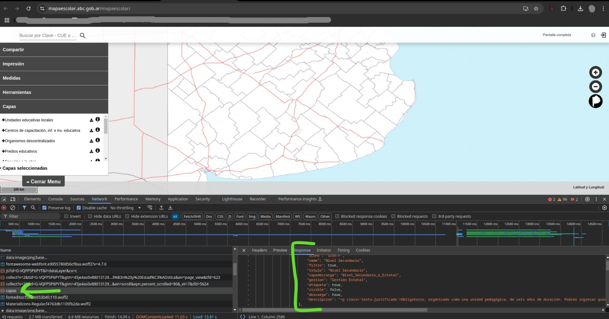

# Backup Mapa Escolar
El mapa escolar de la Provincia de Buenos Aires permite visualizar información geográfica sobre distitos aspectos que hacen al Sistema Educativo de la Provincia.

Este repositorio contiene código Python capaz de realizar una copia de resguardo de toda la información de este sitio, exportada en distintos formatos como CSV, Excel y PDF.

- URL Sitio web: https://mapaescolar.abc.gob.ar/mapaescolar/
- URL JSON capas: https://mapaescolar.abc.gob.ar/capas
- URL descarga archivo de ejemplo: https://mapaescolar.abc.gob.ar/geodie/wfs?service=WFS&version=1.0.0&request=GetFeature&typeName=mapaescolar:Mod_Tec_Prof_Secundaria_G_Estatal&cql_filter=capa=5%20and%20id_sector=6&authkey=5ef2390a-5a6d-4f21-842a-59a07f40f159&outputFormat=csv

## Análisis con Google Chrome DevTools
